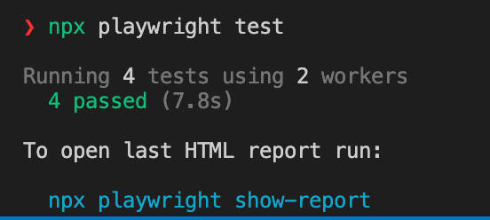

# web-automation-test-suite


Automation test using Playwright and JavaScript as the programming language.

## Pre-Requisites
- Node.js 16+
- Windows 10+, Windows Server 2016+ or Windows Subsystem for Linux (WSL).
- MacOS 12 Monterey or MacOS 13 Ventura.
- Debian 11, Debian 12, Ubuntu 20.04 or Ubuntu 22.04.

## Table of Contents
1. [Getting Started](#getting-started)
2. [Folder Structure](#folder-structure)
3. [Setup](#setup)
4. [Running Tests](#running-tests)
5. [Adding New Tests](#adding-new-tests)
6. [Troubleshot](#troubleshot)
7. [CI/CD Integration](#ci/cd-integration)

### Getting Started
To get started with the project, clone the repository to your local machine.

```
git clone git@github.com:fathirwafda/web-automation-test-suite.git
cd web-automation-test-suite
```

### Folder Structure
The project has the following folder structure:

```
project-root
│
├── node_modules                # Node.js modules
|
├── pages                       # All pages class and method
|    ├── CheckoutPage.js
|    ├── HomePage.js
|    ├── ProductsPage.js
|
├── playwright_report
|
├── test_results                # 
|
├── tests                       # Test directory
│   ├── checkout.test.js        
│   ├── login.test.js
|   ├── product.test.js
|
├── env.sample                  # Sample of Environment variable
├── .env                        # Put your variable and value here
├── package.json                # Node.js package manifest file
└── README.md                   # Some notes for this automation
└── playwright.config.js        # The global config
```

### Setup
1. Install Node.js: If not already installed yet, download and install Node.js from [Node.js Official Website](https://nodejs.org/).

2. Install Dependencies: Navigate to the project root directory in the terminal and run the following command to install the necessary dependencies:

```
npm install
```

3. Copy env.sample to .env as local data:

```
cp env.sample .env
```
Then fill your data/values in this file, don't forget to save.

### Running Tests
Navigate to the project root directory in the terminal and run the following command to execute the tests:

```
npx playwright test
```


### Adding New Tests
1. Create Test File: Create a new .test.js file under the relevant directory inside the tests/ folder.
2. Write Test: write your test cases in the newly created .test.js file.
3. Run Test: Use the npx test command to run your tests and validate that they are working as expected.

### Troubleshot
If you found error this `Error: Cannot find module 'dotenv'`

Install dotenv module
```
npm install dotenv
```

### CI/CD Integration
To integrate with CI/CD would be different for each tools. The following sample is using Gitlab.

1. Define the pipeline on .gitlab-ci.yml: In the root directory of your repository, create or edit the .gitlab-ci.yml:

```yaml
image: node:14  # Use the desired Node.js version

stages:
  - setup
  - test

cache:
  paths:
    - node_modules/

install_dependencies:
  stage: setup
  script:
    - npm ci  # Use npm ci for faster, reproducible builds

run_tests:
  stage: test
  script:
    - npm run test  # This should run the Playwright tests
```

2. Create Images: Using Docker for creating images. This images will store on cloud images repository:

```yaml
include:
  - project: 'repository/url'
    ref: master
    file: '.gitlab-ci.yaml'

image: $CI_REGISTRY/company/web-automation-test-suite:version

build-image:
  stage: test
  image: $CI_REGISTRY/repo/url
  tags:
    - build-image
  variables:
    IMAGE_VERSION: "1.0.0"
  only:
    changes:
    - Dockerfile
    refs:
    - master
  script:
    - docker login -u "$CI_REGISTRY_USER" -p "$CI_REGISTRY_PASSWORD" "$CI_REGISTRY"
    - docker build --build-arg CI_JOB_TOKEN="$CI_JOB_TOKEN" -t $CI_REGISTRY/repor/url web-automation-test-suite:$IMAGE_VERSION . --no-cache
    - docker push $CI_REGISTRY/repor/url web-automation-test-suite:$IMAGE_VERSION
  ```

3. Variables & Secrets: If our tests require environment variables or secrets (like login credentials), set them up in GitLab. Go to your project in GitLab -> Settings -> CI/CD -> Variables.

4. Execute & View Results: Once everything is set up, whenever we push changes to the repository, GitLab CI/CD will automatically trigger the pipeline. We can then view the job logs and test results in the GitLab interface.
